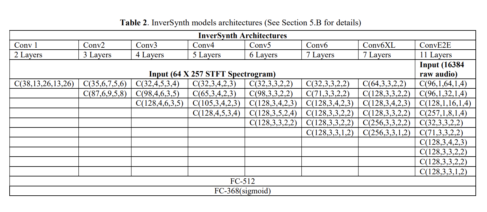

# inver-synth
> A Python implementation of the [InverSynth](https://arxiv.org/abs/1812.06349) method (Barkan, Tsiris, Koenigstein, Katz)

---

NOTE: This implementation is a **work in progress**. Contributions are welcome.

## Installation

```
poetry shell
poetry install
```

## Getting Started

```
poetry run task start
```

## Generating a Training Set

To use defaults:
```
poetry run task generate_sin
```

To customize:
```
python -m generators.fm_generator
```

Parameter | Default | Description
---|---|---
`--num_examples` | `150` | Number of examples to create
`--name` | `InverSynth` | Naming convention for datasets
`--dataset_directory` | `test_datasets` | Directory for datasets
`--wavefile_directory` | `test_waves` | Directory to for wave files. Naming convention applied automatically
`--length` | `1.0` | Length of each sample in seconds
`--sample_rate` | `16384` | Sample rate (Samples/second)
`--sampling_method` | `random` | Method to use for generating examples. Currently only random, but may include whole space later
Optional |
`--regenerate_samples` | | Regenerate the set of points to explore if it exists (will also force regenerating audio)
`--regenerate_audio` | | Regenerate audio files if they exist
`--normalise` | | Apply audio normalization

This will generate a dataset attempting to recreate the generator as defined in the [paper](paper/1812.06349.pdf)


### Experimenting with the E2E or Spectrogram models

First, assign values to following environment variables in a `.env`:

Parameter | Default | Description
---|---|---
`--model` | `e2e` | Model architecture to run from the following: `C1`,`C2`,`C3`,`C4`,`C5`,`C6`,`C6XL`,`e2e`
`--dataset_name` | `InverSynth` | Namespace of dataset generated
Optional |
`--epochs`| `100` | Number of epochs to run
`--dataset_dir`| `test_datasets` | Directory full of datasets to use
`--output_dir`| `output` | Directory where the final model and history will be saved
`--dataset_file`| `None` | Specify an exact dataset file to use
`--parameters_file`| `None` | Specify an exact parameters file to use
`--data_format` | `channels_last` | Image data format for Keras. Select either `channels_last` or `channels_first`. Note: If CPU, only `channels_last` can be selected
`--run_name` | Namespace for output files


Selecting an architecture:

- `C1`, `C2`, `C3`, `C4`, `C5`, `C6`, `C6XL`, `CE2E`, `CE2E_2D`



Training the models:

>  End-to-End learning. A CNN predicts the synthesizer parameter configuration directly from the raw audio. The first
convolutional layers perform 1D convolutions that learn an alternative representation for the STFT Spectrogram. Then, a
stack of 2D convolutional layers analyze the learned representation to predict the synthesizer parameter configuration.

```
python -m models.e2e_cnn
```

or

>  The STFT spectrogram of the input signal is fed into a 2D CNN that predicts the
synthesizer parameter configuration. This configuration is then used to produce a sound that is similar to the input sound.

```
python -m models.spectrogram_cnn
```
