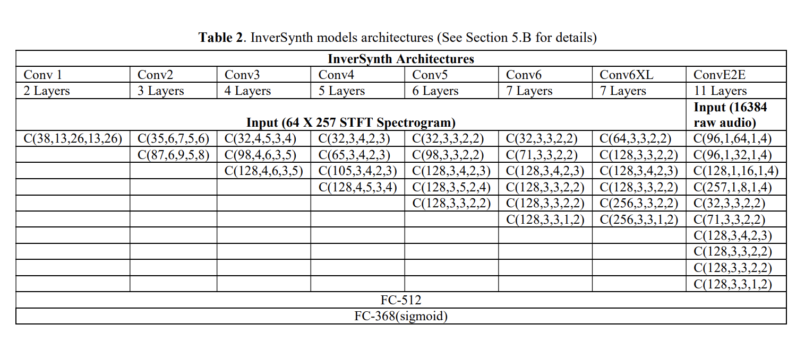

# inver-synth

> Synthesizer parameter estimation from audio — from a CNN paper implementation to a CLAP-powered revival.

A Python implementation of [InverSynth](https://arxiv.org/abs/1812.06349) (Barkan, Tsiris, Koenigstein, Katz, 2019).
Given an audio clip, predict the synthesizer parameters that would recreate it.

---

## History and evolution

### Original (2019–2022) — TensorFlow CNN, VST-based

The original implementation followed the paper directly: a CNN trained to predict
synthesizer parameters from raw audio or STFT spectrograms, using a VST plugin
(Dexed / Lokomotiv) to generate training data via `librenderman`.

Architecture: raw waveform or spectrogram → 1D/2D CNN → parameter vector  
Generator: VST plugin via `librenderman` (Linux only)  
Training: TensorFlow 2.x, Keras, ~150 examples default  
Branch: [`bugfix/fc-layer`](https://github.com/crodriguez1a/inver-synth/tree/bugfix/fc-layer) (original development history)

The CNN showed promise on simple FM sounds but required a working VST host and
`librenderman`, making it hard to run outside a specific Linux + plugin setup.

### Revival (2026) — CLAP backbone, pure-numpy generators

Revived as a backend component for [Synthetroniq](https://github.com/crodriguez1a/synthetroniq),
a synth patch search engine. The goal: given a patch audio file, synthesise a
melody using the patch's timbral character.

Key changes from the original:

| | Original | Revival |
|---|---|---|
| Backbone | CNN trained from scratch | CLAP (`laion/clap-htsat-unfused`, frozen, 512-dim) |
| Generator | VST via librenderman | Pure-numpy FM/wavetable/subtractive |
| Training data | ~150–10k clips | 50k clips, batched CLAP encoding |
| Dependencies | TF 2.x, librenderman, Linux | PyTorch, HuggingFace, any platform |
| Sample rate | 16 kHz | 48 kHz (CLAP requirement) |
| Synth type | Dexed (6-op FM) | 2-op sine FM (always musical) |
| Val MSE | Not reported | 0.035 (fm2op, epoch 101/200) |

The DAFx 2024 finding that motivated using CLAP: a frozen CLAP backbone beats
a trained CNN 3× on MSE for synth parameter estimation. The key insight for
the 2-op FM generator: integer modulator ratios guarantee harmonic sidebands
at every point in parameter space, so every random training example sounds
musical — unlike 4-op random FM which mostly produces noise.

---

## Quick start (Revival / CLAP approach)

```bash
# 1. Create virtualenv and install dependencies
make install

# 2. Generate 50k training clips and pre-compute CLAP embeddings (~30 min)
make corpus-fm2op           # or N=10000 for a smoke test

# 3. Train the MLP head (~10 min on MPS/CUDA, ~30 min on CPU)
make train-fm2op

# 4. Run inference on a patch file
make infer AUDIO=audio/samples/Yamaha-DX7-Bass-C2.wav SYNTH=fm2op MIDI="48 52 55 60"
```

### Variables

| Variable | Default | Description |
|----------|---------|-------------|
| `N` | `50000` | Number of training clips |
| `SR` | `48000` | Sample rate (must match CLAP) |
| `EPOCHS` | `200` | Training epochs |
| `LR` | `3e-4` | Learning rate |
| `BATCH` | `256` | Batch size |
| `AUDIO` | `patch.flac` | Audio file for inference |
| `SYNTH` | `fm` | Synth type: `fm2op`, `fm`, `wavetable`, `subtractive` |
| `MIDI` | `60` | MIDI note(s) to render |
| `OUT` | `output.wav` | Inference output path |

### Benchmark (library confidence)

Requires a running [Synthetroniq](https://github.com/crodriguez1a/synthetroniq)
backend with `SYNTHETRONIQ_INVERSYNTH_CHECKPOINT` set:

```bash
make benchmark              # 50 brands, seed 42
make benchmark BENCH_N=100  # larger sample
```

---

## Architecture (Revival)

```
Audio input (any length, 48 kHz)
    │
    ▼
CLAP encoder (laion/clap-htsat-unfused, frozen)
    │  512-dim pooled embedding
    ▼
MLP regression head  (512 → 256 → 128 → N_params)
    │  sigmoid output — all params in [0, 1]
    ▼
Synthesizer parameters
    │
    ▼
fm2op_render(params, pitch_override_midi=60)  →  audio
```

### Generators

| Module | Params | Description |
|--------|--------|-------------|
| `generators/fm2op.py` | 7 | 2-op sine FM (DX7-style). Integer ratios, always musical. **Recommended.** |
| `generators/fm_numpy.py` | 21 | 4-op FM with multiple waveforms. Random params → noise; not recommended for training. |
| `generators/wavetable_generator.py` | 8 | Additive wavetable + 1-pole LP filter + ADSR |
| `generators/subtractive_generator.py` | 8 | Saw/square → Chamberlin SVF → ADSR |

### Confidence metric

At inference time, re-synthesis cosine similarity measures approximation quality:

```
confidence = cosine(CLAP(input_audio), CLAP(render(predicted_params, C4)))
```

Range 0–1. In practice, values above 0.4 produce recognisably FM-like output.
Library baseline (50 patches, June 2026): mean 28.7%, max 62.4%.
See `benchmarks/results/library_confidence_20260616.json`.

---

## Reproducibility

### Training

```bash
make install
make corpus-fm2op N=50000   # generates data/fm2op.npz
make train-fm2op            # writes checkpoints/fm2op.pt
```

Tested on Apple M-series MPS. CPU and CUDA also work (auto-detected).  
Training time: ~10–12 min on MPS for 200 epochs, 50k clips.

### Committed checkpoint

`checkpoints/fm2op.pt` is committed for immediate inference without retraining:
- `synth_type`: fm2op
- `best_epoch`: 101
- `best_val_mse`: 0.03529
- Trained on: 50k clips, 48 kHz, 200 epochs, AdamW + CosineAnnealingLR

---

## Research roadmap

Five paths to improve quality, documented in [`docs/research-roadmap.md`](docs/research-roadmap.md):

1. **Perceptual loss** — add re-synthesis cosine loss during training (~2 days)
2. **Real DX7 data** — train on rendered Yamaha DX7 sysex banks (~3–4 days)
3. **Differentiable synthesis** — rewrite fm2op in PyTorch, backprop through the synth (~1 week)
4. **Neural timbre transfer** — CLAP-conditioned vocoder, works for all patch types (~2 weeks)
5. **Audio diffusion** — use a pretrained CLAP-conditioned diffusion model (AudioLDM2, Stable Audio Open); zero-shot sub-path A may work without any training

Current blocker: the model approximates ~28% of the library well. FM hardware patches
score higher (Yamaha DX100: ~41%, Alesis Airsynth: 62%). The melody feature in
Synthetroniq is currently parked pending improvements.

---

## Original implementation

The original TensorFlow CNN implementation lives on the
[`bugfix/fc-layer`](https://github.com/crodriguez1a/inver-synth/tree/bugfix/fc-layer)
branch and is preserved for historical reference. Setup instructions for that
approach are below.

### Installation (original)

```
poetry shell
poetry install
```

### Generating a training set (original)

```bash
poetry run task generate
# or
python -m generators.fm_generator --num_examples 150 --sample_rate 16384
```

### Training (original)

```bash
# End-to-end CNN
python -m models.e2e_cnn

# Spectrogram CNN
python -m models.spectrogram_cnn
```

Model architectures: `C1`, `C2`, `C3`, `C4`, `C5`, `C6`, `C6XL`, `CE2E`, `CE2E_2D`



---

## Paper

Barkan, O., Tsiris, D., Koenigstein, N., & Katz, R. (2019).  
*InverSynth: Deep Estimation of Synthesizer Parameter Configurations from Audio Signals.*  
[arXiv:1812.06349](https://arxiv.org/abs/1812.06349) — also at [`paper/1812.06349.pdf`](paper/1812.06349.pdf)
